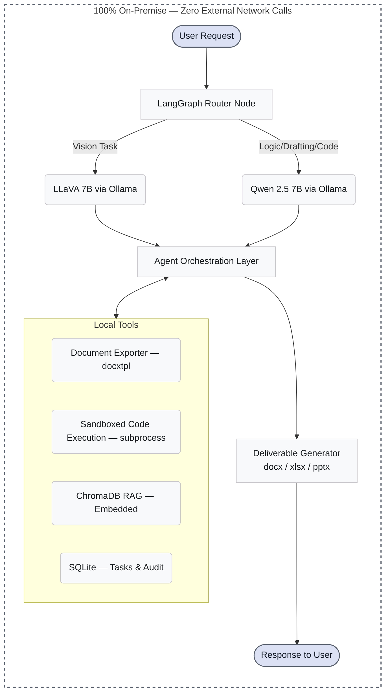
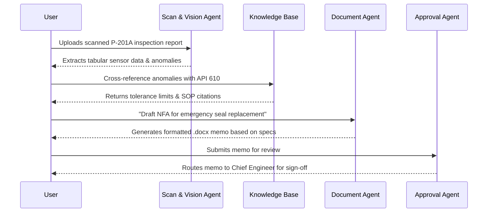

<div align="center">
  <h1>GAURDA</h1>
  <p><b>A sovereign, on-premise agentic AI workbench for confidential industrial work.</b></p>

  
  
  
  
  
  
  
  

</div>

<br />

**GAURDA is an entirely air-gapped, sovereign AI operating system that allows industrial engineers to parse P&IDs, draft compliance notes, run engineering calculations, and query plant documentation using state-of-the-art open-weight models — without a single byte of confidential data ever leaving the corporate network.**

---

## Table of Contents
- [The Problem](#the-problem)
- [The Solution](#the-solution)
- [System Architecture](#system-architecture)
- [The Six Agents](#the-six-agents)
- [User Workflow](#user-workflow)
- [Tech Stack](#tech-stack)
- [Hardware & Deployment Model](#hardware--deployment-model)
- [Getting Started](#getting-started)
- [Project Structure](#project-structure)
- [Running Tests](#running-tests)
- [Roadmap](#roadmap)
- [Team](#team)
- [License](#license)

---

## The Problem
Refineries and Public Sector Undertakings (PSUs) generate immense volumes of highly confidential knowledge work—from API 610 compliance tracking to detailed P&ID schematics and real-time plant telemetry. Because this data is strictly regulated and cannot touch public cloud AI APIs, engineers are cut off from modern productivity gains. This forces a difficult choice: lose thousands of hours to manual data extraction and documentation, or risk catastrophic shadow-IT data leakage by employees quietly using cloud LLMs.

---

## The Solution
GAURDA bridges this gap by bringing powerful agentic AI directly to the edge. It is a fully on-premise, multi-agent AI workbench designed explicitly for confidential industrial engineering.
- **Multi-Model Auto-Routing:** Dynamically routes queries to specialized local open-weight models (Qwen 2.5 for reasoning, LLaVA for vision) via a LangGraph state machine — ensuring only one model is loaded at a time to respect memory constraints.
- **Agentic Multi-Step Execution:** Agents autonomously orchestrate complex workflows using local tools, from sandboxed Python data analysis to semantic document search.
- **Multimodal OCR & Vision:** Extracts tabular specs, tags, and geometry directly from complex engineering PDFs and CAD exports.
- **Real Office-Format Deliverables:** Generates actual `.docx`, `.xlsx`, and `.pptx` files for formal approval processes.
- **Local RAG Knowledge Base:** Indexes OISD standards, refinery SOPs, and inspection reports for instant semantic search via embedded ChromaDB.
- **Provable Sovereignty:** Operates under a strict `pfctl` enforced air-gap — a built-in verification script proves zero external network calls.

---

## System Architecture



---

## The Six Agents

| Agent | Purpose | Capabilities |
|-------|---------|--------------|
| **Reasoning Agent** | General technical queries & troubleshooting. | • Synthesizes inspection logs and vibration metrics.<br>• Answers complex multi-step engineering queries.<br>• Persistent chat history via SQLite. |
| **Scan & Vision Agent** | Extracts data from physical engineering schematics. | • Parses complex P&IDs and pump data sheets.<br>• Digitizes tabular equipment schedules via local OCR.<br>• Returns structured JSON for downstream agents. |
| **Document Agent** | Drafts standardized NFAs and compliance notes. | • Generates formal approval memos (MRPL format).<br>• Exports native `.docx` deliverables via `docxtpl`. |
| **Code & Calculation Agent** | Computes orifice flow rates and fluid dynamics. | • Writes and executes sandboxed Python (math, json, datetime).<br>• Self-correcting: auto-retries failed code up to 2 times.<br>• Strict 5-second timeout kills infinite loops. |
| **Knowledge Base Agent** | Searches indexed OISD standards & refinery SOPs. | • Semantic search across 20+ indexed document chunks.<br>• Returns relevance-scored results with source citations.<br>• Embedded ChromaDB — no separate server process. |
| **Approval & Workflow Agent** | Tracks multi-tier approval chains and signatures. | • SQLite-backed task state management.<br>• Immutable audit trail for every status change.<br>• Full CRUD pipeline for approval workflows. |

---

## User Workflow



This pipeline ensures that an engineer goes from a raw scan to a fully formatted, standards-compliant, and routed approval document without ever leaving the secure on-premise environment.

---

## Tech Stack

| Layer | Technology |
|-------|------------|
| **Frontend** | React, Next.js 14 (App Router), Tailwind CSS v4 |
| **Backend** | FastAPI, Python 3.11+, LangGraph (orchestration) |
| **Local Inference** | Ollama (serving open-weight models locally) |
| **Vector DB / RAG** | ChromaDB (embedded PersistentClient mode) |
| **Persistence** | SQLite (chat history, task state, audit trail) |
| **Code Execution** | Sandboxed subprocess (env-stripped, timeout-enforced) |
| **Deliverables** | `docxtpl`, `python-docx`, `openpyxl`, `python-pptx` |
| **Models** | Qwen 2.5 7B (Reasoning/Code), LLaVA 7B (Vision), Nomic Embed Text (RAG) |

---

## Hardware & Deployment Model

GAURDA operates entirely on-premise. For the purpose of the Smart India Hackathon demo, the entire architecture — inference, orchestration, UI, and RAG — runs concurrently on a single **MacBook Air M4 with 16GB of unified memory**.

The LangGraph state machine enforces **strict sequential model execution** — only one LLM is loaded into memory at any time. This prevents OOM crashes and ensures stable performance under the 16GB constraint.

The system is architected to seamlessly scale to dedicated bare-metal GPU servers for full enterprise deployment, while strictly maintaining the zero-external-network sovereignty guarantee.

---

## Getting Started

### Prerequisites
- Node.js 20+
- Python 3.11+
- [Ollama](https://ollama.com/download) (installed and running)

### Installation

1. **Clone the repository**
   ```bash
   git clone https://github.com/Shrexshth/GARUDA.git
   cd GARUDA
   ```

2. **Install Backend Dependencies**
   ```bash
   python3 -m venv venv
   source venv/bin/activate
   pip install -r backend/requirements.txt
   ```

3. **Install Frontend Dependencies**
   ```bash
   cd frontend
   npm install
   cd ..
   ```

4. **Configure Local Models**
   Ensure Ollama is running (open `/Applications/Ollama.app`), then pull the required models:
   ```bash
   ollama pull qwen2.5:7b
   ollama pull llava:7b
   ollama pull nomic-embed-text
   ```

5. **Seed the Knowledge Base**
   Load the demo manuals (OISD standards, pump SOPs, inspection reports) into ChromaDB:
   ```bash
   source venv/bin/activate
   python demo-data/seed_knowledge_base.py
   ```

6. **Run the Application**
   Use the provided start script to launch both the backend and frontend simultaneously:
   ```bash
   ./run.sh
   ```
   *The workbench will be available at `http://localhost:3000`.*

---

## Project Structure

```text
GARUDA/
├── backend/                # FastAPI backend
│   ├── api/                # Route handlers for all 6 agents
│   │   ├── scan.py         # Vision/OCR upload endpoint
│   │   ├── reasoning.py    # Chat endpoint with SQLite history
│   │   ├── code.py         # Code generation + sandbox execution
│   │   ├── document.py     # NFA drafting + docx export
│   │   ├── knowledge.py    # ChromaDB semantic search
│   │   └── approval.py     # Task CRUD + audit trail
│   ├── core/               # LangGraph orchestrator
│   │   ├── graph.py        # State machine with conditional edges
│   │   ├── nodes.py        # Router, Vision, Reasoning, Tool nodes
│   │   ├── state.py        # GraphState TypedDict definition
│   │   └── config.py       # Environment-driven configuration
│   ├── tools/              # Local capabilities
│   │   ├── sandbox.py      # Isolated Python execution (no Docker)
│   │   ├── document_exporter.py  # docxtpl-based NFA generator
│   │   └── rag_engine.py   # Embedded ChromaDB search engine
│   └── main.py             # FastAPI app entry point + CORS
├── frontend/               # Next.js 14 React UI
│   └── src/app/agents/     # 6 agent pages wired to backend
├── models/                 # Model routing configuration
│   └── routing.yaml        # Ollama model ↔ task mapping
├── rag/                    # ChromaDB persistent storage
├── demo-data/              # Reusable demo inputs
│   ├── manuals/            # OISD, SOP, and inspection report texts
│   ├── calculations/       # Pre-written engineering calc prompts
│   └── seed_knowledge_base.py  # Ingestion script
├── tests/                  # Smoke test suite
│   └── smoke_test.py       # 14 automated tests
├── infra/                  # Security & sovereignty
│   ├── verify_airgap.py    # pfctl air-gap verification
│   └── pf_airgap.conf      # macOS packet filter rules
├── docs/                   # Setup guides
└── run.sh                  # One-command launch script
```

---

## Running Tests

Run the automated smoke test suite (7 tests work without Ollama, 7 require Ollama running):

```bash
./run.sh --test
```

Verify air-gap network isolation:

```bash
./run.sh --airgap
```

---

## Roadmap

- [x] Scaffold core monorepo architecture
- [x] Implement clean, professional design system (Stitch → Tailwind v4)
- [x] Build LangGraph multi-model dynamic router with sequential execution
- [x] Implement all 6 agent backends with FastAPI endpoints
- [x] Wire all 6 frontend pages to backend via React fetch
- [x] Build secure subprocess sandbox (no Docker, env-stripped, timeout-enforced)
- [x] Implement ChromaDB embedded RAG with demo data ingestion
- [x] Implement SQLite persistence (chat history, tasks, audit trail)
- [x] Build `pfctl` network air-gap enforcement and verification
- [x] Build automated smoke test suite (14 tests)
- [ ] Wire dynamic model-routing indicator in the UI
- [ ] Add cross-agent pipeline (scan → KB → NFA → approval)
- [ ] **Demo Target:** End-to-end NFA drafting pipeline with Ollama
- [ ] **Production:** Multi-user role-based access control (RBAC)
- [ ] **Production:** Migrate to dedicated Linux GPU clusters
- [ ] **Production:** Comprehensive audit dashboard and compliance reporting

---

## Team

| Name | Role |
|------|------|
| **Shreshth Singh** | Full-Stack AI Engineer |
| **[Team Member 2]** | Prompt Engineer & RAG Specialist |
| **[Team Member 3]** | UI/UX & Frontend Developer |
| **[Team Member 4]** | Infrastructure & Security |

---

## License

This project is licensed under the [MIT License](LICENSE) - see the LICENSE file for details.
