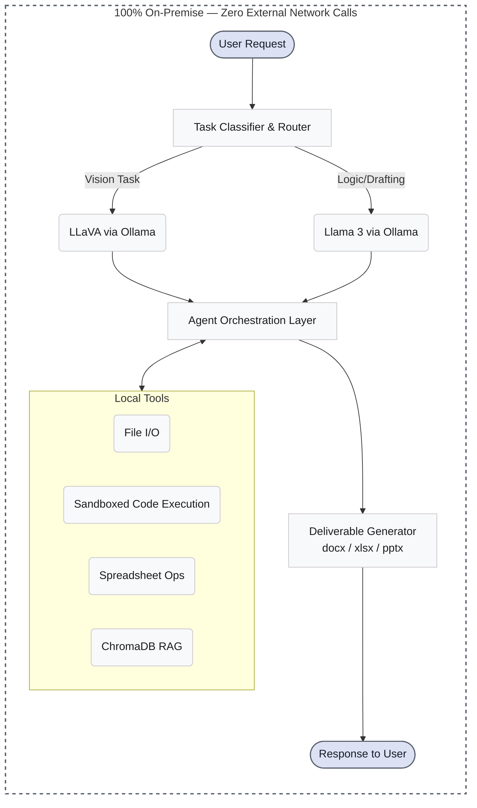
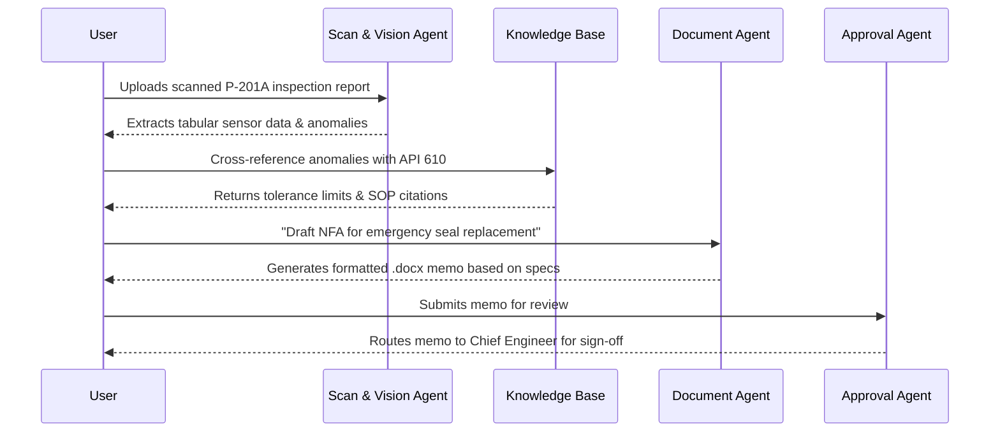

<div align="center">
  <h1>GAURDA</h1>
  <p><b>A sovereign, on-premise agentic AI workbench for confidential industrial work.</b></p>

  
  
  
  
  

  <br />

  

</div>

<br />

**GAURDA is an entirely air-gapped, sovereign AI operating system that allows industrial engineers to parse P&IDs, draft compliance notes, and query plant telemetry using state-of-the-art open-weight models without a single byte of confidential data ever leaving the corporate network.**

---

## Table of Contents
- [The Problem](#the-problem)
- [The Solution](#the-solution)
- [System Architecture](#system-architecture)
- [The Six Agents](#the-six-agents)
- [User Workflow](#user-workflow)
- [Tech Stack](#tech-stack)
- [Hardware & Deployment Model](#hardware--deployment-model)
- [Getting Started](#getting-started)
- [Project Structure](#project-structure)
- [Roadmap](#roadmap)
- [Team](#team)
- [License](#license)

---

## The Problem
Refineries and Public Sector Undertakings (PSUs) generate immense volumes of highly confidential knowledge work—from API 610 compliance tracking to detailed P&ID schematics and real-time plant telemetry. Because this data is strictly regulated and cannot touch public cloud AI APIs, engineers are cut off from modern productivity gains. This forces a difficult choice: lose thousands of hours to manual data extraction and documentation, or risk catastrophic shadow-IT data leakage by employees quietly using cloud LLMs.

---

## The Solution
GAURDA bridges this gap by bringing powerful agentic AI directly to the edge. It is a fully on-premise, multi-agent AI workbench designed explicitly for confidential industrial engineering.
- **Multi-Model Auto-Routing:** Dynamically routes queries to specialized local open-weight models (e.g., Llama 3 for reasoning, LLaVA for vision) based on the task.
- **Agentic Multi-Step Execution:** Agents autonomously orchestrate complex workflows using local tools, from Python data analysis to web search over an internal intranet.
- **Multimodal OCR & Vision:** Extracts tabular specs, tags, and geometry directly from complex engineering PDFs and CAD exports.
- **Real Office-Format Deliverables:** Generates actual `.docx`, `.xlsx`, and `.pptx` files for formal approval processes.
- **Local RAG Knowledge Base:** Indexes decades of OISD standards and plant SOPs for instant semantic search.
- **Provable Sovereignty:** Operates under a strict `pfctl` enforced air-gap—guaranteeing zero external network calls.

---

## System Architecture



---

## The Six Agents

| Agent | Purpose | Capabilities |
|-------|---------|--------------|
| **Reasoning Agent** | General technical queries & troubleshooting. | • Synthesizes inspection logs and vibration metrics.<br>• Answers complex multi-step engineering queries. |
| **Scan & Vision Agent** | Extracts data from physical engineering schematics. | • Parses complex P&IDs and pump data sheets.<br>• Digitizes tabular equipment schedules via local OCR. |
| **Document Agent** | Drafts standardized NFAs and compliance notes. | • Generates formal approval memos (MRPL format).<br>• Exports native `.docx` and `.pdf` deliverables. |
| **Code & Calculation Agent** | Computes orifice flow rates and fluid dynamics. | • Writes and executes sandboxed Python (Scipy/NumPy).<br>• Validates thermodynamic parameters locally. |
| **Knowledge Base Agent** | Searches indexed OISD standards & refinery SOPs. | • Semantic search across millions of tokens.<br>• Precise citation linking to source manuals. |
| **Approval & Workflow Agent** | Tracks multi-tier approval chains and signatures. | • Orchestrates cross-agent pipelines.<br>• Manages document state and review cycles. |

---

## User Workflow



This pipeline ensures that an engineer goes from a raw scan to a fully formatted, standards-compliant, and routed approval document without ever leaving the secure on-premise environment.

---

## Tech Stack

| Layer | Technology |
|-------|------------|
| **Frontend** | React, Next.js (App Router), Tailwind CSS v4 |
| **Backend** | FastAPI, Python 3.11 |
| **Local Inference** | Ollama (serving open-weight models locally) |
| **Vector DB / RAG** | ChromaDB |
| **Code Execution** | Sandboxed local Python REPL |
| **Deliverables** | `python-docx`, `openpyxl`, `python-pptx` |
| **Models** | Llama 3.2 (Reasoning), LLaVA 7B (Vision), Nomic Embed (RAG) |

---

## Hardware & Deployment Model

GAURDA operates entirely on-premise. For the purpose of the Smart India Hackathon demo, the entire architecture—inference, orchestration, UI, and RAG—runs concurrently on a single **MacBook Air M4 with 16GB of unified memory**. The system is container-ready and architected to seamlessly scale to dedicated bare-metal GPU servers (e.g., NVIDIA H100 clusters) for full enterprise deployment, while strictly maintaining the zero-external-network sovereignty guarantee.

---

## Getting Started

### Prerequisites
- Node.js 20+
- Python 3.11+
- Ollama (installed and running)

### Installation

1. **Clone the repository**
   ```bash
   git clone https://github.com/Shrexshth/GARUDA.git
   cd GARUDA
   ```

2. **Install Backend Dependencies**
   ```bash
   python -m venv venv
   source venv/bin/activate
   pip install -r backend/requirements.txt
   ```

3. **Install Frontend Dependencies**
   ```bash
   cd frontend
   npm install
   cd ..
   ```

4. **Configure Local Models**
   Ensure Ollama is running, then pull the required models:
   ```bash
   ollama pull llama3.2
   ollama pull llava:7b
   ollama pull nomic-embed-text
   ```

5. **Run the Application**
   Use the provided start script to launch both the backend and frontend simultaneously:
   ```bash
   ./run.sh
   ```
   *The workbench will be available at `http://localhost:3000`.*

---

## Project Structure

```text
GARUDA/
├── backend/            # FastAPI orchestration layer and API routes
├── frontend/           # Next.js React UI and Tailwind design system
├── core/               # Agent orchestration and multi-model router
├── tools/              # Local capabilities (file I/O, Python sandbox)
├── models/             # Local routing logic (routing.yaml)
├── rag/                # ChromaDB ingestion and semantic search pipelines
├── infra/              # Airgap verification and network enforcement scripts
└── docs/               # Technical documentation and setup guides
```

---

## Roadmap

- [x] Scaffold core monorepo architecture
- [x] Implement clean, professional Stitch design system
- [x] Build multi-model dynamic router logic
- [x] Enforce `pfctl` network air-gap constraints
- [ ] Connect ChromaDB RAG pipeline to Reasoning Agent
- [ ] Implement robust sandboxed Python execution for Code Agent
- [ ] **Demo Target:** Functional end-to-end NFA drafting pipeline
- [ ] **Production:** Implement multi-user role-based access control (RBAC)
- [ ] **Production:** Migrate from local macOS execution to dedicated Linux GPU clusters
- [ ] **Production:** Expand compliance dashboard and comprehensive audit trails

---

## Team

| Name | Role |
|------|------|
| **[Shreshth Singh]** | Full-Stack AI Engineer |
| **[Team Member 2]** | Prompt Engineer & RAG Specialist |
| **[Team Member 3]** | UI/UX & Frontend Developer |
| **[Team Member 4]** | Infrastructure & Security |

---

## License

This project is licensed under the [MIT License](LICENSE) - see the LICENSE file for details.
